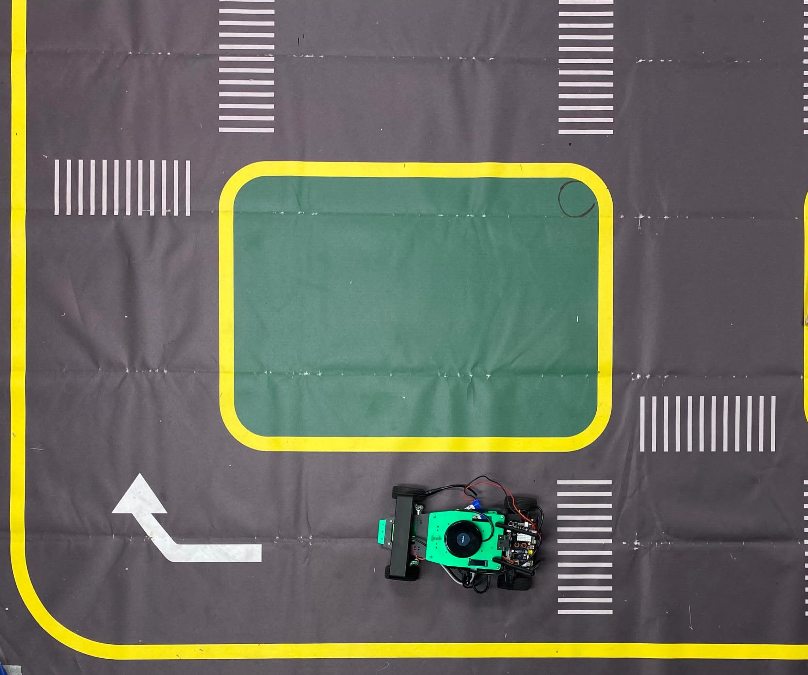

# Autonomous-Driving-Perception

## Basic Overview

 <p align="justify">This project demonstrated the effective use of computer
 vision techniques, control algorithms, and the YOLOv5 model
in developing an autonomous navigation system. Despite the
 challenges faced, the project was successful in achieving
 its objectives and contributed to the field of autonomous
 navigation.</p>
<p align="center"></a></p>

## A. Introduction
<p align="justify">In autonomous driving, perception systems are pivotal as they
 interpret sensory data to understand the envi
 ronment, which is essential for decision-making and planning.
 Ensuring the safety of these perception systems is fundamental
 for achieving high-level autonomy, allowing us to confidently
 delegate driving and monitoring tasks to machines.  This project
 focuses on enhancing the understanding and navigation capabil
 ities of self-driving robots through sensor fusion and computervision techniques. 
 Specifically, it explores the depth based perception using ZED2 camera to improve
 autonomous driving perception.</p>

## B. Background
<p align="justify">In this project, we utilized depth-based perception to en
 able autonomous navigation of the robot in an unfamiliar
 environment. The fusion of 2D LiDAR and depth camera
 sensors demanded substantial computational resources, leading
 to system throttle errors during the object detection task
 alone. In addition to object detection, we also maneuvered the
 Rosmaster R2 bot autonomously, detecting traffic signs such
 as 'Move', 'Turn', and 'Stop'. Depth cameras and traditional
 cameras play critical roles in mobile robot perception, pro
 viding 3D environmental information and facilitating vision
 guided navigation, respectively. Fig1 shows such example of
 the camera that we have used in this project. </p>

  
 ##   C. Hardware and Software Setup

<p align="center"></a></p>

<p align="justify">The project utilized a combination of advanced hardware
 and software to process and analyze sensor data:

* Jetson Xavier Processor: Served as the computational
 backbone, handling data processing and model execution.
* ZED2 RGBD Camera:Provided high-resolution images
 and depth data, crucial for object detection and distance
 estimation. Fig 2 shows such example of the camera that
 we have used in this project.
* ROS (Robot Operating System): Enabled efficient sys
tem integration, data handling, and algorithm implemen
tation.
* ZED SDK: Offered tools and APIs for extracting and
 processing data from the ZED 2 camera.

The integration of these hardware components through ROS
 facilitated a modular approach, allowing for the independent
 development and testing of subsystems. Below figure shows the implemented environment we have used through this project.</p>

 <p align="center"></a></p>


##  D. Challenges and Solution
<p align="justify">The project faced significant challenges in terms of  computational power.
 The computational capacity of the Jetson
 Xavier was limited, which posed a significant hurdle. The
 team was unable to implement 2D LiDAR fusion and the
 ZED 2 camera as initially planned due to these constraints.
 Additionally, the project demanded significant computational
 power for processing depth information from the ZED2 RGBD
 camera and running the YOLOv5 object detection model
 simultaneously to perform Autonomous Navigation. These
 computation demands added to the complexity and challenges
 of the project.<br><br>
Despite the challenges, the team managed to devise effective
 solutions and achieve significant milestones. For depth-based
 perception, the ZED 2 camera was utilized for depth and RGB
 data. The team estimated distances to objects using the depth
 map, which proved to be a valuable asset for the project. For
 autonomous navigation, the team incorporated computer vision
 techniques to detect lanes and control the robot accordingly.
 Werelied on depth data to get the distance of the object (traffic
 sign), which was crucial for the navigation system. To address
 the resource constraints, the team optimized algorithms for
 computational efficiency. We achieved real-time performance
 on Jetson Xavier by prioritizing system efficiency, which
 significantly improved the overall performance of the project.</p>


## E. Working
 <p align="justify">1) Lane Detection: In this project, we embarked on a
 journey to develop an autonomous navigation system, starting with 
 the fundamental task of detecting lanes. </p>
 <p align="justify">
 2) Object Detection: We utilized the YOLOv5 pre-trained
 model for object detection. This model has been widely used
 in various applications, including lane detection, missing road
 lane markings detection, and pedestrian detection. The use of
 YOLOv5 allowed us to effectively detect objects in real-time,
 contributing significantly to the success of the project. Here we
 have detected successfully the 'Stop', 'Move', and 'Turn' signs
 using which robot will perform the task according to the signs.</p>
 <p align="justify">
 3) Depth Estimation: The ZED 2 camera is a powerful
 stereo camera that plays a crucial role in depth estimation for
 autonomous navigation. It combines advances in AI, sensor
 hardware, and stereo vision to build an unmatched solution
 in spatial perception and understanding. The camera features
 ultra-wide depth perception with a 110-degree horizontal and
 70-degree vertical field of view, including optical distortion
 compensation. It also has enhanced low-light vision with an
 f/1.8 aperture and improved ISP, capturing 40 percent more
 light in dark environments. The ZED 2 camera uses stereo
 vision and neural networks to replicate human-like vision,
 enabling depth perception from 0.2 to 20m².  In autonomous navigation,
  this depth information is used to
 identify obstacles, plan paths, and make decisions about the
 robot's movements. </p>

 ```python
    def visualize_detections(self, image, detections, frame_number):
        
        # Visualize detections on the image
        im_draw = image.copy()
        draw = ImageDraw.Draw(im_draw)
        detected_class = ""
        detected_class_distance = 0.0

        for det in detections:
            x1, y1, x2, y2, conf, cls = det
            cls = int(cls)
            
            color = (255, 0, 0)  # RGB color (red in this case)

            # Calculate area
            cx = x1 +(x2-x1)/2
            cy = y1 + (y2-y1)/2
            c = (cx, cy)

            # Assign class name based on class number
            class_name = None  # Default for unknown classes
            if cls == 0:
                class_name = 'Car'

            else:
                class_name = None

            # Check area threshold and publish if conditions are met
            if conf >= 0.8:
                detected_class = class_name
                point_msg = Point()
                point_msg.x = cx
                point_msg.y = cy

                detected_class_distance = (cx,cy)
                self.distance_publisher.publish(point_msg)
                
            # Publish the detected class name and distance
            self.class_publisher.publish(detected_class)

            #self.distance_publisher.publish(point_msg)
            label = "{}: {:.2f}".format(class_name, conf)

            draw.rectangle([x1, y1, x2, y2], outline=color, width=2)
            draw.text((x1, y1), label, fill=color)
            draw.ellipse([(c[0]-radius, c[1]-radius), (c[0]+radius, c[1]+radius)], fill=color)
 ```

 <p align="justify">
  4) PIDController:  The system utilized a PID(Proportional-Integral-Derivative)
 controller for dynamic steering adjustment.The PID controller
 adjusted the robot's steering based on the deviation from the
 desired lane position.This allowed the robot to make smooth
 and precise adjustments to its course, ensuring it stayed on
 track and navigated the lanes effectively. Throughout this
 project,we tried to improve our control as much as possible
 resulting the smooth navigation with in the environment.For lane following, a PID
 controller adjusts v and w to minimize the error between
 the robot's current position and the desired path.</p>

 ```python
 class PIDController:
    def __init__(self, Kp, Ki, Kd, setpoint):
        self.Kp = Kp  # Proportional gain
        self.Ki = Ki  # Integral gain
        self.Kd = Kd  # Derivative gain
        self.setpoint = setpoint  # Setpoint value

        self.error = 0  # Current error
        self.last_error = 0  # Previous error
        self.integral = 0  # Accumulated error

    def update(self, measured_value):
        # Calculate the error
        self.error = self.setpoint - measured_value

        # Calculate the proportional term
        proportional_term = self.Kp * self.error

        # Calculate the integral term
        self.integral += self.error
        integral_term = self.Ki * self.integral

        # Calculate the derivative term
        derivative_term = self.Kd * (self.error - self.last_error)
        self.last_error = self.error

        # Calculate the control output
        control_output = proportional_term + integral_term + derivative_term

        return control_output
```

https://github.com/Urviskumar/-Autonomous-Driving-Perception/assets/98739768/033d0d39-2e08-4bd2-840e-c5d0333ab1b3


## F. ROS Integration
 <p align="justify">The Robot Operating System (ROS) played a pivotal role
 in the implementation of this project. ROS is a flexible
 framework for writing robot software and provides services
 designed for a heterogeneous computer cluster such as hardware abstraction,
 low-level device control, implementation of
 commonly-used functionality, message-passing between processes, and package management.</p>

 <p align="justify">For object detection, the YOLOv5 model was 
 integrated into the ROS framework. The images from the camera were passed
 to the YOLOv5 node, which detected objects of interest and
 published the detections as ROS messages. These messages
 were used to trigger specific actions by the robot.
 The ZED 2 camera was used to obtain depth information,
 which was crucial for object distance estimation. </p>


https://github.com/Urviskumar/-Autonomous-Driving-Perception/assets/98739768/7e57924c-33b4-4871-89c8-27f249627703


## G. Results and Analysis
 <p align="justify">The robot demonstrated a high degree of proficiency in
 following lane markings detected in the camera images. It
 employed techniques such as color filtering and line fitting to
 identify lanes. The robot was able to adjust its steering to stay
 within the lanes, demonstrating the effectiveness of the control
 algorithms implemented. The success in lane following is a
 testament to the robustness of the computer vision techniques
 and control algorithms used in this project.<br><br>
The robot was capable of detecting objects of interest within
 its environment, such as ”Turn”, ”Go”, or ”Stop” signs. This
 was achieved using advanced computer vision techniques.
 The detection was used to trigger specific actions by the
 robot, adding a layer of interactivity and responsiveness to the
 system. The successful detection of objects of interest and the
 subsequent triggering of actions demonstrate the effectiveness
 of the object detection algorithms implemented.<br><br>
 The robot was able to estimate the distance to detected
 objects using depth information obtained from the camera.
 This information was crucial for making decisions about when
 to execute certain actions, such as stopping or turning. The
 ability to accurately estimate distances to objects is a critical
 component of autonomous navigation systems, as it allows the
 system to interact safely and effectively with its environment.
 The success in object distance estimation indicates the effec
tiveness of the depth perception capabilities of the system.</p>

 

## H. Conclusion
<p align="justify">In conclusion, the results obtained from this project demon
 strate the effectiveness of the techniques and algorithms im
 plemented. The robot was able to follow lanes, detect objects,
 and estimate distances to objects accurately, demonstrating its
 potential for real-world applications in autonomous navigation.</p>

