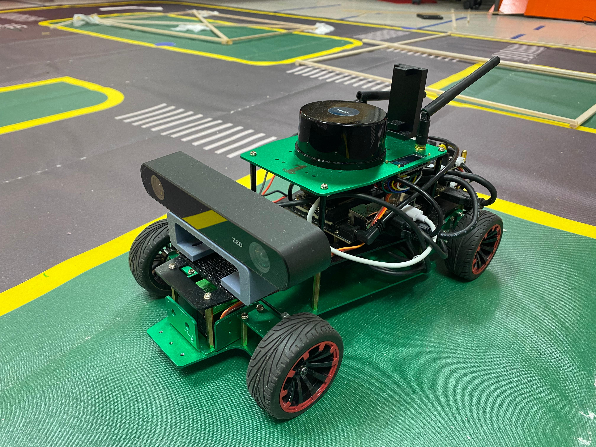
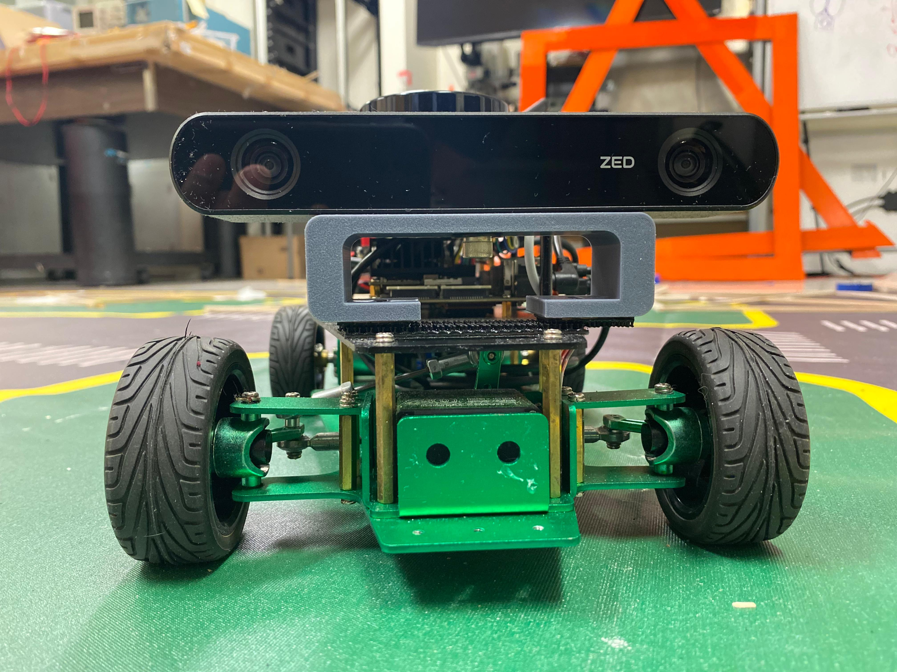

# Autonomous-Driving-Perception

</a>

## Introduction

In autonomous driving, perception systems are pivotal as they
 interpret sensory data to understand the envi
 ronment, which is essential for decision-making and planning.
 Ensuring the safety of these perception systems is fundamental
 for achieving high-level autonomy, allowing us to confidently
 delegate driving and monitoring tasks to machines.  This project
 focuses on enhancing the understanding and navigation capabil
 ities of self-driving robots through sensor fusion and computervision techniques. 
 Specifically, it explores the depth based perception using ZED2 camera to improve
 autonomous driving perception.

## Background
In this project, we utilized depth-based perception to en
 able autonomous navigation of the robot in an unfamiliar
 environment. The fusion of 2D LiDAR and depth camera
 sensors demanded substantial computational resources, leading
 to system throttle errors during the object detection task
 alone. In addition to object detection, we also maneuvered the
 ROSmaster R2 bot autonomously, detecting traffic signs such
 as 'Move', 'Turn', and 'Stop'. Depth cameras and traditional
 cameras play critical roles in mobile robot perception, pro
 viding 3D environmental information and facilitating vision
 guided navigation, respectively. Fig1 shows such example of
 the camera that we have used in this project. 

  
 ##   A. Hardware and Software Setup

</a>

The project utilized a combination of advanced hardware
 and software to process and analyze sensor data:

* Jetson Xavier Processor: Served as the computational
 backbone, handling data processing and model execution.
* ZED2RGBDCamera:Providedhigh-resolution images
 and depth data, crucial for object detection and distance
 estimation. Fig 2 shows such example of the camera that
 we have used in this project.
* ROS (Robot Operating System): Enabled efficient sys
tem integration, data handling, and algorithm implemen
tation.
* ZED SDK: Offered tools and APIs for extracting and
 processing data from the ZED 2 camera.

The integration of these hardware components through ROS
 facilitated a modular approach, allowing for the independent
 development and testing of subsystems.

##  B. Challenges and Solution
The project faced significant challenges in terms of  computational power.
 The computational capacity of the Jetson
 Xavier was limited, which posed a significant hurdle. The
 team was unable to implement 2D LiDAR fusion and the
 ZED 2 camera as initially planned due to these constraints.
 Additionally, the project demanded significant computational
 power for processing depth information from the ZED2 RGBD
 camera and running the YOLOv5 object detection model
 simultaneously to perform Autonomous Navigation. These
 computation demands added to the complexity and challenges
 of the project.  
Despite the challenges, the team managed to devise effective
 solutions and achieve significant milestones. For depth-based
 perception, the ZED 2 camera was utilized for depth and RGB
 data. The team estimated distances to objects using the depth
 map, which proved to be a valuable asset for the project. For
 autonomous navigation, the team incorporated computer vision
 techniques to detect lanes and control the robot accordingly.
 Werelied on depth data to get the distance of the object (traffic
 sign), which was crucial for the navigation system. To address
 the resource constraints, the team optimized algorithms for
 computational efficiency. We achieved real-time performance
 on Jetson Xavier by prioritizing system efficiency, which
 significantly improved the overall performance of the project.